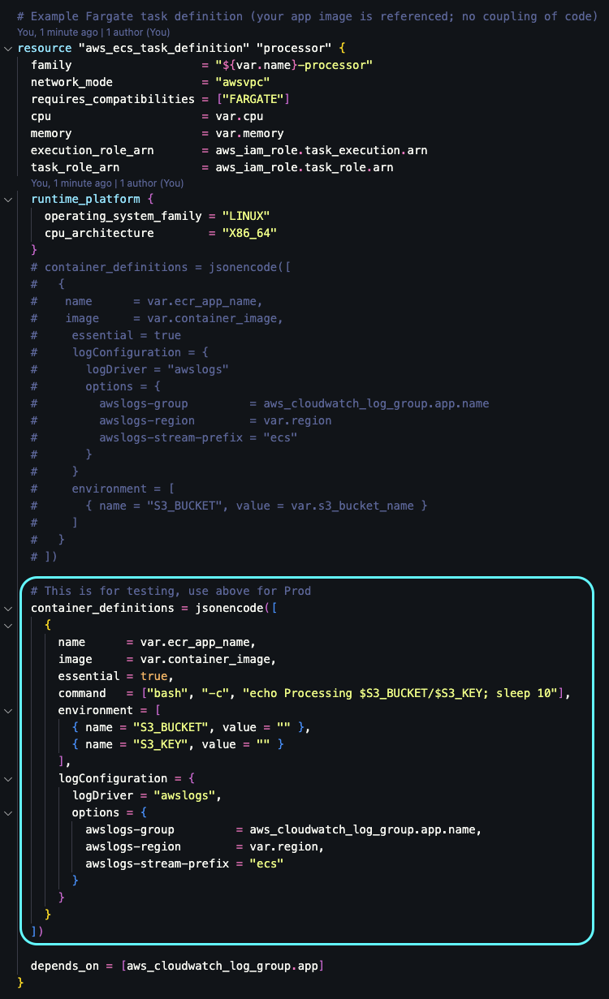

### Private ECS Processing Flow (S3 → EventBridge → ECS)

1. **Private VPC**
   - ECS tasks run in private subnets with no public IPs.
   - There is **no Internet Gateway and no NAT Gateway** — tasks have no public egress.

2. **S3 → EventBridge Trigger**
   - The S3 bucket has **EventBridge notifications enabled**.
   - Every new object upload can trigger an EventBridge rule.
   - You can apply filters:
     - **Prefix** (e.g., `"inbound/"`) → only trigger on files in a given folder.
     - **Suffix** (e.g., `".csv"`) → only trigger on files with a certain extension.
     - If both are empty, **all uploads** in the bucket trigger the ECS task.

3. **EventBridge Rule → ECS Task**
   - When an event matches, EventBridge runs an ECS task in the cluster.
   - The task uses Fargate, runs inside the private subnets, and is attached to a controlled security group.
   - Environment variables (like the bucket name) can be passed to the container.

4. **Networking (Private Endpoints)**
   - **S3 Gateway Endpoint** allows tasks to access S3 privately (no public internet).
   - **Interface Endpoints** for `ecr.api`, `ecr.dkr`, `ecs`, `ecs-telemetry`, and `logs` keep image pulls, telemetry, and logs fully private.
   - No outbound internet access exists — tasks can only reach AWS services through VPC endpoints.

5. **Security Controls**
   - The ECS task IAM role has least-privilege access (only to the specific bucket/prefix it needs).
   - The S3 bucket policy can restrict access to only the VPC endpoint (`aws:sourceVpce`), blocking all other access paths.

---

✅ Result: Every new file upload to S3 (optionally filtered by prefix/suffix) triggers a **private ECS task** that processes it, with **no internet connectivity** and all AWS service traffic routed through VPC endpoints.

---

## Gotcha's
1. **Task Definition Config (Prod vs Test)**
   - By default, the task definition includes a testing block (with a simple bash command to echo S3 values and sleep). When promoting to production, remove the test block and uncomment the production container definition above so the task uses real environment variables and log configuration.
   

 

